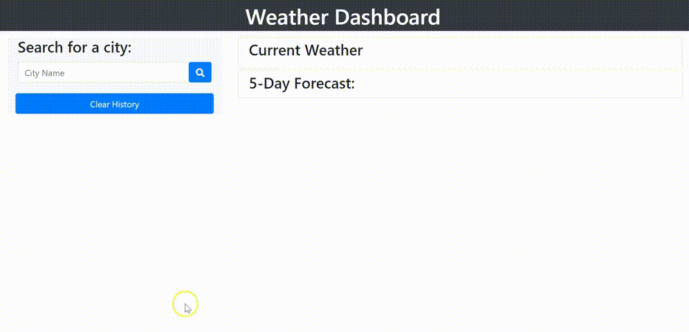

# Weather-Dashboard

[](https://opensource.org/licenses/MIT)

## Description
The application provides the weather details and the 5-day forecast for the city that the user enters in the search field. It also lists the city names in the search history.

## Website
https://deepikabekal.github.io/Weather-Dashboard/.

## Screenshot



## Technologies Used
* HTML
* CSS
* Javascript

## Libraries
* Moment.js (https://momentjs.com/)
* jQuery (https://jquery.com/)
* Font Awesome (https://fontawesome.com/)
* Google fonts (https://developers.google.com/fonts)
* day.js (https://day.js.org/)

## API used
OpenWeather One Call API (https://openweathermap.org/api)

## Contact Info
If any queries please send me an email at deepika.bekal2@gmail.com

## User Story
```
AS A traveler
I WANT to see the weather outlook for multiple cities
SO THAT I can plan a trip accordingly
```

## Acceptance Criteria
```
GIVEN a weather dashboard with form inputs
WHEN I search for a city
THEN I am presented with current and future conditions for that city and that city is added to the search history
WHEN I view current weather conditions for that city
THEN I am presented with the city name, the date, an icon representation of weather conditions, the temperature, the humidity, the wind speed, and the UV index
WHEN I view the UV index
THEN I am presented with a color that indicates whether the conditions are favorable, moderate, or severe
WHEN I view future weather conditions for that city
THEN I am presented with a 5-day forecast that displays the date, an icon representation of weather conditions, the temperature, the wind speed, and the humidity
WHEN I click on a city in the search history
THEN I am again presented with current and future conditions for that city.
```

## Code logic
* Get the city name the user entered in the event listener call back function for the search button.
* Pass the city name as a parameter to a function.
      * Make an API call with city name and units (for getting the data in the correct units) as the query parameter along with the API key.
      * Pass the city name and the data from the API call as parameter to another function (to get geo coordinates of the city)
      * Add a catch statement to to display a message, if the user enters wrong city name.
* A function for One Call API call.
      * Takes the city name and data as the parameter.
      * Using the API data get latitude and longitude of the city.
      * Make the API call using the latitude, longitudeand units as the query parameters along with api key.
      * Call a function to get the current weather details. Pass city name and data as parameters.
      * Call a function to get 5-day forecast details. Pass city name and data as parameters.
      * Call a function to save the search history in local storage. Pass city name, latitude and longitude as parameters.
      * Add a catch statement to display a message if there is an error.
* A function to get the current weather details. 
      * Takes the city name and API data as arguments.
      * Convert the unix timestamp(format in which the date is stored in the API) to date format.
      * Get and display the weather information.
      * Call a function to display appropriate color for UV Index
* A function to display the appropriate color for UV Index.
      * Takes the UV index as argument.
      * If statement to check in what range the UV Index is.
            * 0-3, favourable condition, Green
            * 3-7, moderate condition, Orange
            * More than 7, severe condition, Red
* A function to display 5 day weather forecast 
      * Takes the city name and API data as arguments.
      * Get and display the weather information for the next 5 days using for loop.
* A function to save the search history in local storage.
      * Takes city name, lattitude and longitude as arguments.
      * Get the data stored in the local storage and save it in an array. 
      * In an object variable save the city name, latitude and longitude. 
      * If the local storage is not empty then using for loop check if the city name is already exists in the array. 
            * If yes then remove the existing city entry from the array.
      * Push the object in to the array.
      * Save the array in the local storage. 
      * Call a function to display the search history. Pass array as parameter.
* A function to display the search history. 
      * Takes array as argument. 
      * Using for loop display the city name in the array on the page as button.
* An event listerner for parent element of the city name buttons.
      * In the call back function
          * Clear containers for current weather, 5 day forecast, search history and error message display. 
          * Get the city name on the button.
          * Call a function to display current weather and pass the city name as parameter. 
* An event listener for clear search history button with a call back function.
      * Clear containers for search history, error message display.
      * Clear local storage.


## References
* Study Material for HTML, CSS and javascript provided by Trilogy Education Services.
* www.w3schools.com
* jQuery Documentation (https://api.jquery.com/)
* Stack overflow (https://stackoverflow.com/)
* MDN Web Docs (https://developer.mozilla.org/en-US/docs/Web/JavaScript)
* 
